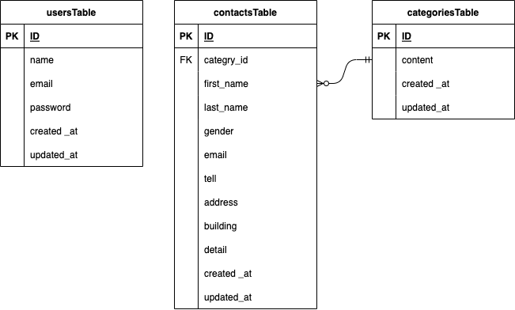

# FashionablyLate（お問い合わせフォーム）

お問い合わせホーム

- **ユーザー側**

- **管理者側**


## 作成した目的

学習のアウトプットとして作成

## アプリケーション URL

### 開発環境
- ローカル：http://localhost  
  アプリケーションにアクセスするためのURL。
- phpMyAdmin：http://localhost:8080/  
  データベースを管理するためのツール。

## 機能一覧

### ユーザー
- お問い合わせフォーム入力
- お問い合わせフォームの確認画面
- サンクスページ
### 管理者側
- 会員登録機能
- ログイン機能
- ログアウト機能
- お問い合わせ一覧
- データの詳細表示
- CSV形式でエクスポート
- 検索機能
  - 名前で検索
  - メールアドレスで検索
  - 性別で検索
  - お問い合わせ種類で検索
  - 日付で検索  
  ※検索欄に全て入力・選択をしなくても検索可能  
  ※入力フォームは部分一致と完全一致検索が可能

## 仕様技術

- **バックエンド**
  - PHP7.4.9
  - Laravel8.83.27
  - MySQL8.0.26

- **フロントエンド**
  - Nginx1.21.1

- **開発環境**
  - Docker/Docker-compose

## ER図



## 環境構築

**Docker ビルド**

1. `git@github.com:Shinji-0323/Fashionably-Late.git`
2. DockerDesktop アプリを立ち上げる
3. `docker-compose up -d --build`このコマンドでDockerコンテナを起動し、必要な環境を構築します。


#### ＊MySQLは、OSによって起動しない場合があるのでそれぞれのPCに合わせて docker-compose.yml ファイルを編集してください。


**Laravel 環境構築**

1. `docker-compose exec php bash`
2. `composer install`
3. `cp .env.example .env`　このコマンドで「.env.example」を 「.env」にコピー
4. `.env` ファイルを設定してください（例として以下を参考にしてください）

```text
DB_CONNECTION=mysql
DB_HOST=mysql
DB_PORT=3306
DB_DATABASE=laravel_db
DB_USERNAME=laravel_user
DB_PASSWORD=laravel_pass
```

5. アプリケーションキーの作成

```bash
php artisan key:generate
```

6. マイグレーションの実行

```bash
php artisan migrate
```

7. シーディングの実行

```bash
php artisan db:seed
```
